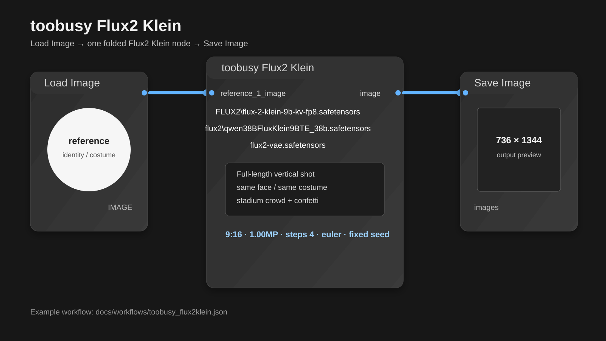

# toobusy · 너무바쁜베짱이

**번거로운 여러 단계를 노드 하나로 접어버리는** ComfyUI 커스텀 노드 모음입니다.  
여러 노드를 일일이 배선하기 귀찮은 사람을 위해, 한 노드가 체인 전체를 삼킵니다.

> **Fold the graph.** — toobusy folds tedious multi-step ComfyUI workflows into single production nodes.

현재 문서는 **v0.2.11** 기준입니다.

## Quick Start

```bash
cd ComfyUI/custom_nodes
git clone https://github.com/nicekriss/toobusy.git toobusy
```

업데이트:

```bash
cd ComfyUI/custom_nodes/toobusy
git pull
```

ComfyUI를 재시작하세요. 프런트엔드(JS) 변경을 받은 뒤에는 브라우저를 강력 새로고침(hard refresh) 하는 것을 권장합니다.

처음 설치했다면 예제 워크플로우부터 여는 것이 가장 빠릅니다.

1. ComfyUI에서 `docs/workflows/korean_scene_to_ideogram4.json`을 드래그해 엽니다.
2. 워크플로우 안의 Note 노드에 적힌 모델 파일과 필요한 커스텀 노드를 준비합니다.
3. `toobusy Ideogram Prompt Polish`에 한국어 장면을 입력합니다.
4. 출력된 `ideogram_json`을 `Ideogram Layout Builder`의 `Import polished`로 가져옵니다.
5. 레이아웃을 확인하거나 수정한 뒤 `toobusy Ideogram4 T2I`로 이미지를 생성합니다.

핵심 흐름:

```text
한국어 장면
-> Ideogram용 구조화 프롬프트
-> Layout Builder에서 구도 확인
-> Ideogram4 이미지 생성
```

`Ideogram4 T2I`는 웹 API가 아니라 **로컬 Ideogram4 모델용 노드**입니다. 해당 모델과 ComfyUI의 Ideogram4 지원 노드가 준비되어 있어야 합니다.

## 지금 중심 기능

| 구분 | 노드 | 한 줄 설명 |
|---|---|---|
| 영상 | `toobusy Wan SCAIL Extend Sampler` | Wan 2.1 SCAIL-2 생성 + 익스텐드 체인을 1노드로 접습니다. |
| 이미지 | `toobusy Flux2 Klein` | Flux2 Klein 9B 레퍼런스 생성 그래프를 1노드로 접습니다. |
| 이미지 | `toobusy Z-Image Turbo` | Z-Image Turbo t2i/img2img/latent-in 그래프를 1노드로 접습니다. |
| 보정 루프 | `toobusy Hires Upscale` | 업스케일 + 리샘플 + VAE Encode를 하이레즈 픽스용 1노드로 접습니다. |
| 컨트롤 | `toobusy ZIT ControlNet` | Z-Image Turbo 앞에 depth/canny/pose 컨트롤을 모듈처럼 붙입니다. |
| 기획 | `toobusy Keyframe Maker` | 아이디어와 참조 이미지를 샷 비트/키프레임 프롬프트로 정리합니다. |
| 기획 | `toobusy Storyboard Board` | ComfyUI 안에서 이미지 보드와 키프레임 마킹을 처리합니다. |
| 기획 | `toobusy Paint Canvas` | 그래프 앞단에서 러프 페인팅과 마스크를 만들고 바로 생성 노드로 보냅니다. |
| 텍스트 인코더 | `toobusy Load CLIP` | safetensors/`.gguf` 텍스트 인코더를 한 노드로 로드합니다. |
| Ideogram | `toobusy Ideogram Prompt Polish` / `Layout Builder` / `Ideogram4 T2I` | 한국어 장면 → 구조화 프롬프트 → 레이아웃 → 로컬 Ideogram4 생성 흐름입니다. |
| LTX | `toobusy LTX2.3` 3종 | LTX2.3 AV 프롬프트, 빈 latent, 샘플러 블록을 컴팩트하게 만듭니다. |

노드는 두 갈래로 접혀 있습니다.

- **`toobusy/Plan`** — 기획·연출·프롬프트·스토리보드 작업을 접습니다.
- **`toobusy/Make`** — 이미지/영상 생성 파이프라인을 접습니다.

## v0.2.11에서 특히 달라진 점

- **`toobusy Wan SCAIL Extend Sampler` 프레임 계획 추가**: `frame_mode`를 `target total`로 두면 원하는 총 프레임만 입력하고, 노드가 base/extend 청크를 자동 분할합니다. 기존 +/- 방식은 `manual segments`로 그대로 쓸 수 있습니다.
- **SCAIL color_match 조절 강화**: `color_match_strength`와 `color_sample`이 추가되어, 클로즈업/와이드샷 전환에서 다음 청크가 한 색으로 물드는 상황을 줄이기 쉬워졌습니다.
- **SCAIL-2 예제 워크플로우 교체**: `docs/workflows/wan21_scail2.json`을 최신 SCAIL 노드 중심 예제로 갱신했습니다.

## v0.2.10에서 특히 달라진 점

- **`toobusy Flux2 Klein` 추가**: Flux2 Klein 9B 레퍼런스 그래프를 1노드로 접었습니다. 레퍼런스 슬롯은 최대 5개, LoRA 슬롯도 최대 5개까지 쓸 수 있습니다.
- **`toobusy Load CLIP` 추가**: safetensors와 `.gguf` 텍스트 인코더를 한 노드로 로드합니다. 토큰 수가 늘어난 커스텀/파인튜닝 LLM도 임베딩 크기를 맞춰 로드할 수 있습니다.
- **`toobusy Z-Image Turbo` 강화**: `positive_override` / `negative_override` / `latent_override` / `zit_control` 입력과 `model` / `model_clean` / `clip` / `vae` / `positive` / `negative` passthrough 출력이 추가되어, 외부 샘플러 없이 하이레즈 루프를 닫기 쉬워졌습니다.
- **`toobusy Hires Upscale` 추가**: 4x 업스케일 모델 → 리샘플 → VAE Encode를 한 노드로 묶었습니다.
- **`toobusy ZIT ControlNet` 추가**: depth/canny/pose 컨트롤을 Z-Image Turbo에 모듈처럼 연결합니다.
- **`toobusy Wan SCAIL Extend Sampler` 개선**: 익스텐드 청크 색 드리프트를 줄이기 위해 `color_anchor` 옵션이 추가되었습니다.

## 대표 데모

### 1. Wan SCAIL-2 — 영상 생성/익스텐드 그래프 접기

<p align="center">
  <a href="docs/workflows/wan21_scail2_sample.mp4">
    
  </a>
</p>
<p align="center"><sub>↑ SCAIL-2 결과 영상 미리보기 — 클릭하면 mp4. 워크플로우: <a href="docs/workflows/wan21_scail2.json">wan21_scail2.json</a></sub></p>

### 2. Flux2 Klein — 레퍼런스 이미지 기반 생성 그래프 접기

<p align="center">
  <a href="docs/workflows/toobusy_flux2klein.json">
    
  </a>
</p>
<p align="center"><sub>↑ Load Image → toobusy Flux2 Klein → Save Image. 워크플로우: <a href="docs/workflows/toobusy_flux2klein.json">toobusy_flux2klein.json</a></sub></p>

`toobusy Flux2 Klein`은 레퍼런스 이미지를 받아 Flux2 Klein 9B 생성 체인을 한 노드로 접습니다. 이 예제는 9:16, 1MP, Euler, 4 steps 기준이며, 레퍼런스의 인물과 의상 특징을 유지한 전신 세로 이미지를 만드는 흐름입니다.

```text
model_name : FLUX2\flux-2-klein-9b-kv-fp8.safetensors
clip_name  : flux2\qwen38BFluxKlein9BTE_38b.safetensors
vae_name   : flux2-vae.safetensors
```

### 3. Ideogram4 — 한국어 장면에서 레이아웃과 이미지까지

<p align="center">
  <a href="docs/workflows/korean_scene_to_ideogram4.json">
    
  </a>
</p>
<p align="center"><sub>↑ Prompt Polish → Layout Builder → Ideogram4 T2I. 워크플로우: <a href="docs/workflows/korean_scene_to_ideogram4.json">korean_scene_to_ideogram4.json</a></sub></p>

<table>
  <tr>
    <td align="center" width="25%"><a href="docs/workflows/sample1.jpg"></a></td>
    <td align="center" width="25%"><a href="docs/workflows/sample2.jpg"></a></td>
    <td align="center" width="25%"><a href="docs/workflows/sample3.jpg"></a></td>
    <td align="center" width="25%"><a href="docs/workflows/sample4.jpg"></a></td>
  </tr>
</table>
<p align="center"><sub>↑ toobusy Ideogram 계열 노드로 만든 결과 — 클릭하면 원본.</sub></p>

### 4. Z-Image Turbo — t2i/img2img/latent-in 그래프를 한 노드로

<p align="center">
  <a href="docs/workflows/z_image_turbo.json">
    
  </a>
</p>
<p align="center"><sub>↑ Z-Image Turbo 예제 워크플로우. 결과 예시: <a href="docs/workflows/z_image_turbo_sample.png">z_image_turbo_sample.png</a></sub></p>

## 왜 “접기”인가 — Before → After

설치하면 **기존 그래프가 짧아집니다.** 그게 toobusy의 약속입니다.

| 노드 | Before | After |
|---|---|---|
| **Wan SCAIL Extend Sampler** | SCAIL-2 생성 + 익스텐드 + 오버랩 트림 + 색보정 체인 | **1 노드** |
| **Flux2 Klein** | Flux2 Klein 9B 레퍼런스 그래프 + KV cache + reference latent 체인 | **1 노드** |
| **Z-Image Turbo** | UNET/CLIP/VAE 로더 + LoRA + 인코딩 + 샘플러 + 디코드 | **1 노드** |
| **ZIT ControlNet** | depth/canny/pose 전처리 + Fun-ControlNet-Union 패치 체인 | **1 노드** |
| **Hires Upscale** | 업스케일 모델 로드 + 업스케일 + 리샘플 + VAE Encode | **1 노드** |
| **Ideogram4 T2I** | 로컬 Ideogram4 로더/컨디셔닝/스케줄러/샘플러/디코드 체인 | **1 노드** |
| **LTX2.3 Compact AV Sampler** | LTX2.3 AV 샘플링 블록 | **1 노드** |
| **Keyframe Maker** | 브리프 → 샷 비트 → 비주얼 앵커 → 키프레임 → 스토리 | **1 노드** |
| **Storyboard Board** | 외부 보드 앱 + 캡처 + 임포트 | **노드 안에서 바로** |
| **Paint Canvas** | 외부 페인팅 앱 + 저장 + Load Image 왕복 | **노드 안에서 바로** |

> 새 노드 추가 기준도 동일합니다: **“이게 귀찮은 여러 단계를 하나로 접나?”** — Yes만 들어옵니다.

## 필요한 것 & 제약

완벽한 척보다 **“이 조건에서 검증됨”** 을 적습니다. 접기 노드는 내부에서 여러 ComfyUI 노드/모델을 호출하므로, 전제가 갖춰져야 동작합니다.

| 노드 | 필요한 것 | 제약 / 검증 조건 |
|---|---|---|
| **Wan SCAIL Extend Sampler** | 외부 `model`/`clip`/`vae` 로더 + `reference_image` + `pose_video` + 최신 ComfyUI SCAIL-2 코어 | 코어 `WanSCAILToVideo`에 SCAIL-2 확장 입력이 필요합니다. SAM3/KJNodes/VHS는 예제 워크플로우 재현에 필요합니다. |
| **Flux2 Klein** | Flux2 Klein 9B 모델 + Qwen3 계열 Flux2 텍스트 인코더 + Flux2 VAE | 레퍼런스 #1은 기본적으로 출력 크기 기준이 됩니다. `size_mode`로 ratio/manual 강제가 가능합니다. |
| **Z-Image Turbo** | Z-Image Turbo 디퓨전 모델 + `lumina2` 텍스트 인코더 + VAE | 모델 파일이 ComfyUI 모델 폴더에 있어야 합니다. |
| **ZIT ControlNet** | Z-Image-Turbo-Fun-Controlnet-Union 모델 패치 + 선택적 controlnet_aux | depth/pose 전처리는 `comfyui_controlnet_aux`가 필요합니다. Canny는 코어 노드로 폴백합니다. |
| **Ideogram4 T2I** | 로컬 Ideogram4 모델 + ComfyUI Ideogram4 지원 노드 + UNET 2개(model/uncond) + `ideogram4` CLIP | **웹 API가 아닙니다.** Ideogram4 미지원 빌드에서는 실행 시점에 실패합니다. |
| **Keyframe Maker** | `clip`에 텍스트 생성 가능한 모델 + ComfyUI `TextGenerate` 노드 | 출력 품질은 연결한 LLM에 좌우됩니다. |
| **LTX2.3** | ComfyUI에 LTX 2.3 노드셋(`LTXV*`) + LTX 모델/VAE/텍스트 인코더 | LTX 지원이 없는 환경에서는 실행 시점에 실패합니다. |
| **Storyboard Board / Paint Canvas** | Pillow·numpy·torch | 이미지와 레이어 데이터는 워크플로우에 임베드되므로, 너무 많이 넣으면 JSON이 커질 수 있습니다. |
| **Load CLIP** | safetensors 또는 `.gguf` 텍스트 인코더 | `.gguf`는 ComfyUI-GGUF가 설치돼 있어야 로드됩니다. Text Generate용 프롬프트 인핸서에는 Gemma 계열이 안전합니다. |

> 모델 파일은 저장소에 포함하지 않습니다. 각 모델은 ComfyUI의 해당 폴더(`diffusion_models`/`text_encoders`/`vae`/`loras`/`model_patches`)에 직접 두세요.

## 예제 워크플로우

`docs/workflows/`에 “열면 돌아가는” 워크플로우를 둡니다.

- [`wan21_scail2.json`](docs/workflows/wan21_scail2.json) — **Wan 2.1 SCAIL-2 모션 트랜스퍼 예제(36노드).** 레퍼런스 이미지 + 댄스 영상 → `toobusy Wan SCAIL Extend Sampler` 중심 구성으로 베이스 생성 + 익스텐드 흐름을 확인합니다. 결과: [`wan21_scail2_sample.mp4`](docs/workflows/wan21_scail2_sample.mp4).
- [`toobusy_flux2klein.json`](docs/workflows/toobusy_flux2klein.json) — **`toobusy Flux2 Klein` 한 노드로 레퍼런스 이미지 기반 생성 그래프를 접는 예제.** Load Image → Flux2 Klein → Save Image 구성입니다.
- [`korean_scene_to_ideogram4.json`](docs/workflows/korean_scene_to_ideogram4.json) — **한국어 장면 → Prompt Polish → Layout Builder → Ideogram4 T2I.** 처음 사용자는 이 워크플로우를 먼저 열어 전체 흐름을 확인하는 것을 권장합니다.
- [`z_image_turbo.json`](docs/workflows/z_image_turbo.json) — **`toobusy Z-Image Turbo` 한 노드로 t2i/img2img 기본 그래프를 접는 예제.** `image` 입력에 Load Image를 연결하면 자동으로 img2img로 전환됩니다.

## 추천 조합

### Wan SCAIL-2 모션 트랜스퍼 / 익스텐드

```text
reference_image + pose_video
-> Wan SCAIL Extend Sampler
-> video / preview frames
```

SCAIL-2 예제는 여러 전처리와 익스텐드 단계를 하나로 접는 흐름을 보여줍니다. 세그먼트/마스크/비디오 저장 쪽 커스텀 노드는 예제 워크플로우 안의 Note를 확인하세요.

### Flux2 Klein 레퍼런스 생성

```text
Load Image
-> reference_1_image
-> Flux2 Klein
-> image / latent / model / model_clean / clip / vae / positive
```

레퍼런스 슬롯은 최대 5개까지 확장할 수 있습니다. 기본 `size_mode`는 `from reference`라서 reference #1의 크기를 따릅니다. 세로 숏을 강제하고 싶으면 예제처럼 `size_mode`를 `ratio + megapixels`, `ratio_preset`을 `9:16`으로 둡니다.

### Z-Image Turbo 하이레즈 루프

```text
Z-Image Turbo
-> Hires Upscale
-> Z-Image Turbo(latent_override)
```

첫 번째 Z-Image Turbo의 `image` / `latent` / `vae` / `positive` / `negative` 출력을 재사용하면, 외부 로더나 CLIPTextEncode를 반복해서 깔지 않고 2차 패스를 구성할 수 있습니다.

### Z-Image Turbo + ControlNet

```text
Paint Canvas 또는 Load Image
-> ZIT ControlNet(depth/canny/pose)
-> Z-Image Turbo(zit_control)
```

`ZIT ControlNet`을 연결하지 않으면 기존 Z-Image Turbo 동작과 동일합니다.

### Storyboard → 영상 기획

```text
Storyboard Board에서 이미지 카드 배치
-> K로 키프레임 마킹
-> keyframes 출력
-> 영상 생성/기획 노드로 연결
```

이미지 보드가 단순 메모장이 아니라, 실제 IMAGE 배치 출력으로 이어지는 키프레임 허브가 됩니다.

## FAQ / Troubleshooting

### Ideogram4 T2I가 왜 안 돌아가나요?

이 노드는 웹 Ideogram API 호출 노드가 아닙니다. **로컬 Ideogram4 모델**과 ComfyUI의 Ideogram4 지원 노드가 필요합니다.

### Z-Image Turbo에서 모델이 이상하게 잡힙니다.

v0.2.10부터 파일명 퍼지 스캔으로 Z-Image 모델/텍스트 인코더/VAE를 자동 감지합니다. 그래도 엉뚱한 파일이 잡히면 `model_name` / `clip_name` / `vae_name`을 직접 지정하세요.

### Z-Image Turbo 2차 패스에서 어떤 model 출력을 써야 하나요?

같은 해상도와 같은 컨트롤 조건을 이어갈 때는 `model`을 써도 됩니다. 다른 해상도 2차 패스나 LoRA를 바꿔 끼우는 흐름이라면 `model_clean`이 더 안전합니다.

### Flux2 Klein에서 전신 세로샷이 잘리면?

프롬프트에 `full-length`, `head to toe`, `entire body visible`, `standing upright`, `both feet on the ground`처럼 구도 제약을 명확히 넣고, `ratio + megapixels`에서 9:16 세로 비율을 먼저 고정하세요.

### Load CLIP으로 Llama/Dolphin GGUF를 로드했는데 Text Generate가 안 됩니다.

로드 자체와 `generate()` 지원은 다릅니다. ComfyUI 래퍼상 Text Generate 프롬프트 인핸서로는 Gemma 계열이 가장 안전합니다.

### 워크플로우 JSON이 너무 커집니다.

Storyboard Board와 Paint Canvas는 이미지를 `board_data` / `canvas_data`에 임베드합니다. 이미지나 레이어가 많을수록 워크플로우 JSON이 커집니다.

## 로드맵

단기 계획:

1. 0.2.11 기준 예제 워크플로우와 문서 정리.
2. 메인 README는 가볍게 유지하고, 노드별 상세 설명은 `docs/`로 분리.
3. ComfyUI-Manager / Registry 배포 기준 점검.

## 라이선스

이 저장소의 라이선스는 [`LICENSE`](LICENSE)를 확인하세요.
