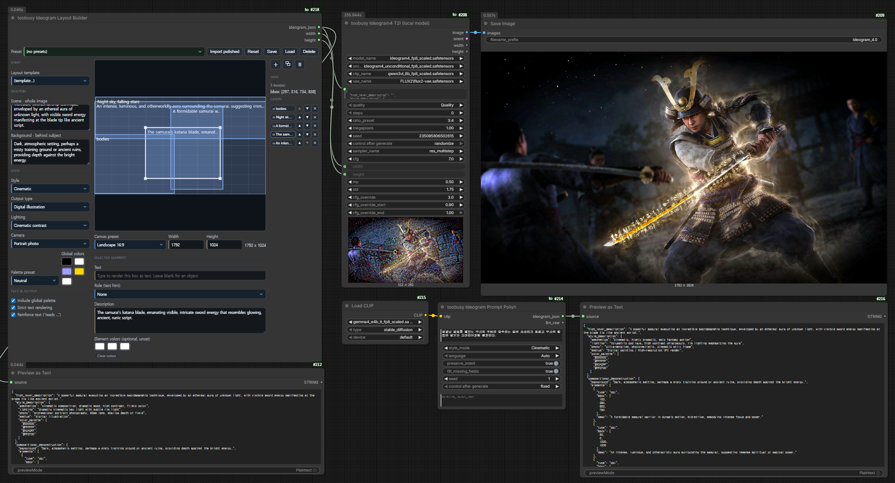
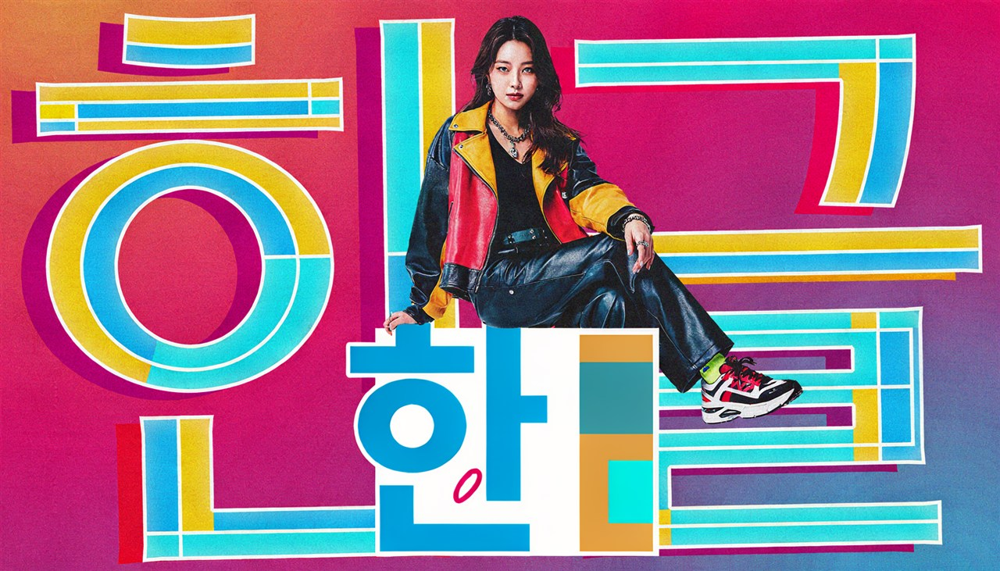
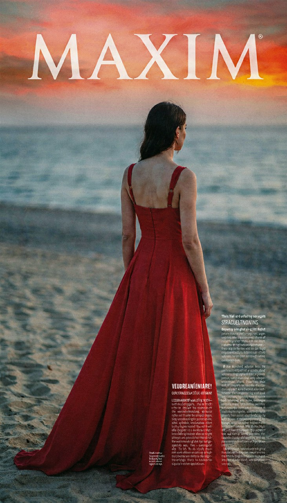
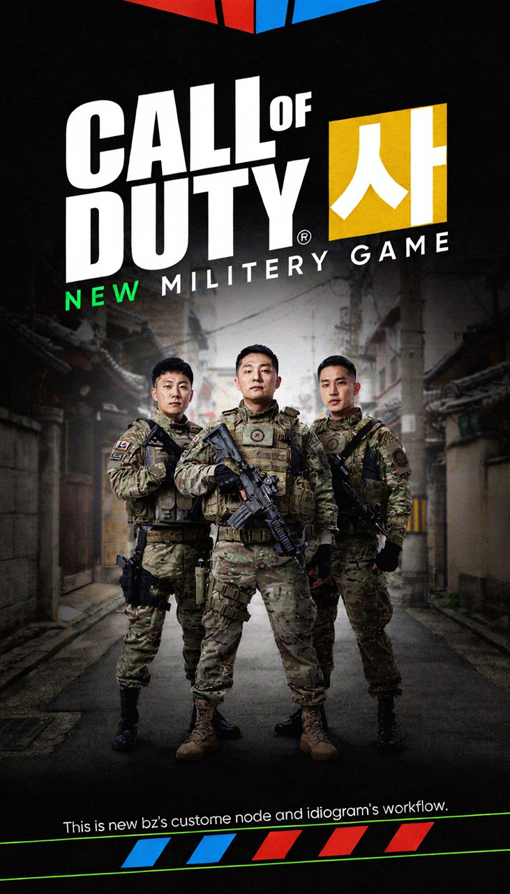
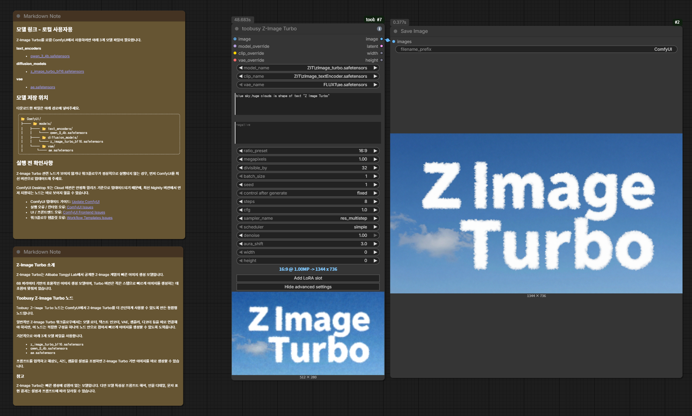

# toobusy · 너무바쁜베짱이

**번거로운 여러 단계를 노드 하나로 접어버리는** ComfyUI 커스텀 노드 모음입니다.
12개 노드를 일일이 배선하기 귀찮은 사람을 위해, 한 노드가 체인 전체를 삼킵니다.

> **Fold the graph.** — toobusy folds tedious multi-step ComfyUI workflows into single production nodes.

## 대표 데모

### 1. Wan SCAIL-2 — 영상 생성/익스텐드 그래프 접기

<p align="center">
  <a href="docs/workflows/wan21_scail2_sample.mp4">
    
  </a>
</p>
<p align="center"><sub>↑ SCAIL-2 결과 영상 미리보기 — 클릭하면 mp4. 워크플로우: <a href="docs/workflows/Wan21_SCAIL2_Testing_neobabae.json">wan21_scail2.json</a></sub></p>

### 2. Ideogram4 — 한국어 장면에서 레이아웃과 이미지까지

<p align="center">
  <a href="docs/workflows/korean_scene_to_ideogram4.json">
    
  </a>
</p>
<p align="center"><sub>↑ Prompt Polish → Layout Builder → Ideogram4 T2I. 워크플로우: <a href="docs/workflows/korean_scene_to_ideogram4.json">korean_scene_to_ideogram4.json</a></sub></p>

<table>
  <tr>
    <td align="center" width="25%"><a href="docs/workflows/sample1.jpg"></a></td>
    <td align="center" width="25%"><a href="docs/workflows/sample2.jpg"></a></td>
    <td align="center" width="25%"><a href="docs/workflows/sample3.jpg"></a></td>
    <td align="center" width="25%"><a href="docs/workflows/sample4.jpg"></a></td>
  </tr>
</table>
<p align="center"><sub>↑ toobusy Ideogram 계열 노드로 만든 결과 — 클릭하면 원본.</sub></p>

### 3. Z-Image Turbo — t2i 그래프를 한 노드로

<p align="center">
  <a href="docs/workflows/z_image_turbo.json">
    
  </a>
</p>
<p align="center"><sub>↑ Z-Image Turbo 예제 워크플로우. 결과 예시: <a href="docs/workflows/z_image_turbo_sample.png">z_image_turbo_sample.png</a></sub></p>

노드는 두 갈래로 접혀 있습니다:

- **`toobusy/Plan`** — 기획·연출·프롬프트를 접는다: Keyframe Maker, Storyboard Board, Ideogram Layout Builder, Ideogram Prompt Polish
- **`toobusy/Make`** — 생성 파이프라인을 접는다: Z-Image Turbo, Ideogram4 T2I, LTX2.3 3종

현재 README에서 바로 확인할 수 있는 대표 흐름:

- `toobusy Wan SCAIL Extend Sampler`
- `toobusy Ideogram Prompt Polish` + `toobusy Ideogram Layout Builder` + `toobusy Ideogram4 T2I`
- `toobusy Z-Image Turbo`

SCAIL-2는 레퍼런스 이미지와 포즈 영상을 받아 영상 생성/익스텐드 체인을 접고, Ideogram4는 한국어 장면을 구조화 프롬프트와 레이아웃으로 정리한 뒤 로컬 모델로 이미지를 만들며, Z-Image Turbo는 텍스트→이미지 기본 그래프를 한 노드로 줄입니다.

`toobusy Ideogram4 T2I`도 선택형 외부 모델 override 입력을 받습니다: `model_override`·`uncond_model_override`(MODEL), `clip_override`(CLIP), `vae_override`(VAE). 연결된 소켓은 해당 내부 로더를 건너뛰고(미연결 시 `model_name`/`unconditional_model_name`/`clip_name`/`vae_name`으로 내부 로드), GGUF 등 다른 로더의 모델을 그대로 사용할 수 있습니다.

함께 쓰기 좋은 노드:

- `toobusy Keyframe Maker`
- `toobusy Storyboard Board`
- `toobusy LTX2.3` 컴팩트 노드들

## 왜 "접기"인가 — Before → After

설치하면 **기존 그래프가 짧아집니다.** 그게 toobusy의 약속입니다.

| 노드 | Before (직접 배선) | After |
|---|---|---|
| **Wan SCAIL Extend Sampler** | SCAIL-2 컨디셔닝 + 샘플러 + 디코드 + 익스텐드 반복 + 프레임 결합/색보정 — 약 20노드+ | **1 노드** |
| **Ideogram4 T2I** | 로더 4 + 선택적 LoRA 체인 + 인코딩 + ConditioningZeroOut + CFGOverride + DualModelGuider + RandomNoise + KSamplerSelect + Ideogram4Scheduler + EmptyLatent + SamplerCustomAdvanced + VAEDecode — 약 13노드+ | **1 노드** |
| **Z-Image Turbo** | UNET·CLIP·VAE 로더 + (LoRA×N) + ModelSamplingAuraFlow + CLIPTextEncode×2 + EmptyLatentImage + KSampler + VAEDecode — 약 10노드 | **1 노드** |
| **LTX2.3 Compact AV Sampler** | RandomNoise + ConcatAVLatent + CFGGuider + KSamplerSelect + ManualSigmas + SamplerCustomAdvanced + SeparateAVLatent + CropGuides — 8노드 | **1 노드** |
| **LTX2.3 Empty AV Latents** | EmptyLTXVLatentVideo + LTXVEmptyLatentAudio (+커스텀 오디오: AudioVAEEncode + SolidMask + SetLatentNoiseMask) | **1 노드** |
| **Keyframe Maker** | 브리프 → 샷 비트 → 비주얼 앵커 → 키프레임 → 스토리, 5단계 수동 프롬프팅 | **1 노드** |
| **Storyboard Board** | 외부 화이트보드 앱 + 캡처 + 임포트 | **노드 안에서 바로** |
| **Ideogram Layout Builder** | 구조화 프롬프트 JSON을 손으로 작성 | **캔버스에 박스 드래그** |
| **Ideogram Prompt Polish** | 한국어 장면 작성 → 영어 번역 → Ideogram 구조화, 매번 머릿속 멀티스텝 | **1 노드** (장면만 한국어로 쓰면 끝) |

> 새 노드 추가 기준도 동일합니다: **"이게 귀찮은 여러 단계를 하나로 접나?"** — Yes만 들어옵니다.

## 필요한 것 & 제약 (솔직하게)

완벽한 척보다 **"이 조건에서 검증됨"** 을 적습니다. 접기 노드는 내부에서 여러 ComfyUI 노드/모델을 호출하므로, 그 전제가 갖춰져야 동작합니다.

| 노드 | 필요한 것 | 제약 / 검증 조건 |
|---|---|---|
| **Wan SCAIL Extend Sampler** | 외부 `model`/`clip`/`vae` 로더 + `reference_image` + `pose_video` + 최신 ComfyUI SCAIL-2 코어 | 코어 `WanSCAILToVideo`에 SCAIL-2 확장 입력이 필요합니다. SAM3/KJNodes/VHS는 예제 워크플로우 재현에 필요합니다 |
| **Ideogram4 T2I** | **로컬 Ideogram 4 모델** + ComfyUI의 Ideogram4 지원 노드(`Ideogram4Scheduler`/`CFGOverride`/`DualModelGuider` 등) + UNET 2개(model/uncond) + `ideogram4` CLIP | **웹 API가 아닙니다.** Ideogram4 미지원 빌드에선 실행 시점에 실패합니다 |
| **Z-Image Turbo** | Z-Image Turbo 디퓨전 모델 + `lumina2` 텍스트 인코더 + VAE | 해당 모델 파일이 모델 폴더에 있어야 합니다 |
| **Keyframe Maker** | `clip`에 **텍스트 생성 가능한 모델**(Gemma/LTX 등) + ComfyUI `TextGenerate` 노드 | 출력 품질은 연결한 LLM에 좌우됩니다. 내부에서 `seed`~`seed+4`를 사용 |
| **LTX2.3 (3종)** | ComfyUI에 LTX 2.3 노드셋(`LTXV*`) 설치 + LTX 모델/VAE/텍스트 인코더 | LTX 지원이 없는 환경에선 실행 시점에 실패합니다 |
| **Storyboard Board** | (코어만) Pillow·numpy·torch | 드롭한 이미지는 `board_data`에 임베드 → 이미지가 많으면 그래프 JSON이 커집니다. 폰트는 arial→기본 폴백 |

> 모델 파일은 저장소에 포함하지 않습니다. 각 모델은 ComfyUI의 해당 폴더(`diffusion_models`/`text_encoders`/`vae`/`loras`)에 직접 두세요.

## 예제 워크플로우

`docs/workflows/`에 "열면 돌아가는" 워크플로우를 둡니다.

- [`wan21_scail2.json`](docs/workflows/wan21_scail2.json) — **Wan 2.1 SCAIL-2 모션 트랜스퍼 풀 그래프(92노드).** 레퍼런스 이미지 + 댄스 영상 → SAM3 세그멘테이션 → 베이스 생성 + 익스텐드 2회. `toobusy Wan SCAIL Extend Sampler`가 접는 대상이 바로 이 그래프의 샘플링 체인입니다(before/after 비교용). 결과: [`wan21_scail2_sample.mp4`](docs/workflows/wan21_scail2_sample.mp4). 최신 ComfyUI 코어(SCAIL-2) + SAM3/KJNodes/VHS 필요.
- [`korean_scene_to_ideogram4.json`](docs/workflows/korean_scene_to_ideogram4.json) — **한국어 장면 → Prompt Polish → (Import polished로) Layout Builder → Ideogram4 T2I.** 한국어 한 줄이 영어 구조화 프롬프트 + 레이아웃 + 이미지로 흐르는 흐름입니다. 처음 사용자는 이 워크플로우를 먼저 열어 전체 흐름을 확인하는 것을 권장합니다. 필요한 모델 링크는 워크플로우 안 Note 노드에 있습니다.
- [`z_image_turbo.json`](docs/workflows/z_image_turbo.json) — **`toobusy Z-Image Turbo` 한 노드로 t2i 그래프(~10노드)를 접는 예제.** `image` 입력에 Load Image를 연결하면 자동으로 img2img로 전환됩니다. 필요한 모델 링크는 워크플로우 안 Note 노드에 있습니다(Comfy-Org Z-Image Turbo / Qwen3-4B / Flux VAE).

## 설치

이 저장소를 `ComfyUI/custom_nodes` 아래에 `toobusy`라는 이름으로 클론한 뒤 ComfyUI를 재시작하세요.

```bash
cd ComfyUI/custom_nodes
git clone https://github.com/nicekriss/toobusy.git toobusy
```

이후 업데이트:

```bash
cd ComfyUI/custom_nodes/toobusy
git pull
```

프런트엔드(JS) 변경을 받은 뒤에는 ComfyUI를 재시작하고 브라우저를 강력 새로고침(hard refresh) 하세요.

## 3분 첫 실행 루트

처음 설치했다면 예제 워크플로우부터 여는 것을 추천합니다.

1. ComfyUI에서 `docs/workflows/korean_scene_to_ideogram4.json`을 드래그해 엽니다.
2. 워크플로우 안의 Note 노드에 적힌 모델 파일과 필요한 커스텀 노드를 준비합니다.
3. `toobusy Ideogram Prompt Polish`에 한국어 장면을 입력합니다.
4. 출력된 `ideogram_json`을 복사합니다.
5. `Ideogram Layout Builder`의 `Import polished`를 눌러 붙여넣고, preview를 확인한 뒤 `Apply`합니다.
6. 박스/색상/구도를 필요하면 수정합니다.
7. `toobusy Ideogram4 T2I`로 이미지를 생성합니다.

핵심 흐름은 이렇습니다:

```text
한국어 장면
-> Ideogram용 구조화 프롬프트
-> Layout Builder에서 구도 확인
-> Ideogram4 이미지 생성
```

`Ideogram4 T2I`는 웹 API가 아니라 로컬 Ideogram4 모델용 노드입니다. 해당 모델과 ComfyUI의 Ideogram4 지원 노드가 준비되어 있어야 합니다.

## 활성 노드

### toobusy Keyframe Maker

카테고리:

```text
toobusy/Plan
```

선택적인 참조 이미지와 짧은 아이디어를 스토리보드/키프레임 텍스트 출력으로 바꿔주는 노드입니다.
제품 광고, 뮤직비디오, 단편 드라마 형식의 시퀀스에 사용할 수 있습니다.

모드:

- `Product Commercial`: 이미지를 제품 참조로 분석하여 광고 시퀀스를 구성합니다.
- `Music Video`: 이미지를 인물/비주얼 참조로 분석하여 무드 중심의 뮤직비디오 시퀀스를 구성합니다.
- `Short Drama`: 이미지를 인물/비주얼 참조로 분석하여 짧은 내러티브 시퀀스를 구성합니다.

입력:

- `clip`: 텍스트 생성이 가능한 CLIP/텍스트 인코더. 예를 들어 ComfyUI `TextGenerate`에서 쓰는 Gemma/LTX 텍스트 모델.
- `product_image` (선택): 제품·인물·비주얼 참조 이미지. 생략하면 `idea`, `style`, `fixed_elements`로부터 참조 브리프를 만듭니다.
- `mode`: 스토리보드 모드. 현재 옵션은 `Product Commercial`, `Music Video`, `Short Drama`.
- `idea`: 핵심 사건, 변화, 스토리 훅, 또는 장면 방향.
- `style`: 비주얼 톤, 카메라 스타일, 조명, 무드, 장르.
- `fixed_elements`: 모든 샷에서 일관되게 유지되어야 하는 제품/캐릭터/색상/배경 규칙.
- `shot_count`: `shot_beats_override`가 비어 있을 때 생성할 샷 개수.
- `seed`: 기본 시드. 내부 텍스트 생성 단계에서 `seed`, `seed + 1`, `seed + 2`, `seed + 3`을 사용합니다.
- `product_brief_override` (선택): 채워져 있으면 이미지/텍스트 브리프 생성을 건너뛰고 이 텍스트를 참조 브리프로 사용합니다.
- `shot_beats_override` (선택): 채워져 있으면 샷 비트 생성을 건너뜁니다.

출력:

- `product_brief`: 생성된 참조 브리프의 호환용 이름. 제품 모드가 아닐 때는 인물/비주얼 브리프입니다.
- `shot_beats`
- `visual_anchor`
- `keyframe_prompts`
- `keyframe_prompt_line`: `keyframe_prompts`를 줄 단위로 나눈 리스트 출력입니다. 앞뒤 공백과 빈 줄은 기본으로 제거되며, 프롬프트/문자열 입력에 연결하면 한 줄씩 하위 노드를 실행합니다.
- `korean_story`

내부 흐름:

```text
product_image + mode -> 참조 브리프
또는 idea + style + fixed + mode -> 참조 브리프
참조 브리프 + idea + style + fixed + shot_count -> 샷 비트
샷 비트 + 참조 브리프 + style + fixed -> 키프레임 프롬프트
브리프 + idea + style + 비트 + 키프레임 프롬프트 -> 한국어 스토리 설명
```

오버라이드 동작:

- `product_brief_override`가 채워져 있으면 이미지/텍스트 브리프 생성 결과는 무시됩니다.
- `shot_beats_override`가 채워져 있으면 샷 비트 생성은 무시됩니다.
- `shot_beats_override`를 사용할 때 실제 샷 개수는 `shot_count` 위젯이 아니라 오버라이드 텍스트의 비어 있지 않은 줄 수가 됩니다.

프런트엔드는 텍스트 입력 후에도 노드가 읽기 쉽도록 toobusy 색조의 입력 가이드와 요약 패널을 덧붙입니다.

실행 후에는 `Use generated brief as override` / `Use generated shot beats as override` 버튼으로 방금 생성된 브리프·샷 비트를 해당 오버라이드 칸에 그대로 복사할 수 있습니다. 비싼 초기 단계를 고정해두고 이후 단계만 다시 생성하며 반복 작업할 때 유용합니다.

### toobusy Storyboard Board

카테고리:

```text
toobusy/Plan
```

ComfyUI 그래프 안에 사는 **Excalidraw 스타일 무한 화이트보드**입니다. 이미지를 모으고,
메모를 쓰고, 샷 구성을 잡고 — 마음에 드는 이미지 카드를 **키프레임으로 마킹**하면
그대로 영상 노드로 흘려보낼 수 있습니다 (이미지 → 키프레임 → 영상 기획 허브).

캔버스:

- **무한 캔버스 + 팬/줌**: 휠 = 팬, Ctrl+휠 = 커서 기준 줌, Space 드래그/핸드 툴 = 팬.
  레티나(DPR) 대응으로 어떤 줌에서도 선명합니다. 뷰 위치는 워크플로우에 저장됩니다.
- **도트 그리드 + 출력 프레임**: 캔버스에 `output W × H` 프레임이 표시되어 어느 영역이
  이미지로 익스포트되는지 항상 보입니다. `F` 또는 줌 바의 fit 버튼으로 프레임에 맞춤.
- **플로팅 툴바**(아이콘): Select(V) · Hand(H) · Pen(P) · Text(T) · Rect(R) · Ellipse(O)
  · Arrow(A) · 이미지 삽입 · Undo/Redo. 도형은 Excalidraw처럼 **드래그로 크기를 그리며**
  만듭니다.

이미지 & 키프레임:

- 이미지는 **드래그&드롭, Ctrl+V 붙여넣기, 툴바 버튼** 세 가지로 올립니다. 올린 이미지는
  자동 다운스케일(최대 1536px) 후 `board_data`에 임베드 — 워크플로우 파일이 무한정
  커지지 않습니다. 카드는 라운드 코너+그림자로 렌더됩니다.
- 이미지 카드를 선택하고 `K`(또는 더블클릭, 속성 패널의 ★)를 누르면 **키프레임**으로
  마킹되고 순번 배지가 붙습니다. 마킹 순서가 곧 출력 순서이고, 해제하면 자동 재번호.

편집:

- **인라인 텍스트 편집**: 더블클릭하면 캔버스 위에서 바로 타이핑(팝업 없음). 빈 캔버스
  더블클릭 = 새 텍스트.
- **컨텍스트 속성 패널**(선택 시 좌측): 색 프리셋 스와치, 채움, 선 두께 S/M/L, 폰트
  S/M/L, 키프레임 토글, Front/Back/Copy/삭제.
- 4코너 리사이즈(이미지는 비율 유지, Alt로 해제), 화살표는 양 끝점. Ctrl+D 복제,
  방향키 미세 이동(Shift = 10배), Ctrl+Z/Y 실행취소.

출력:

- `image`: 출력 프레임(`0,0`~`width,height`) 영역의 보드 렌더.
- `board_data`: 보드 JSON(재사용/디버깅).
- `keyframes`: 키프레임으로 마킹한 이미지들의 **IMAGE 배치**(마킹 순서대로,
  `keyframe_fit`으로 crop/pad/stretch 피팅). 키프레임이 없으면 보드 렌더로 폴백.
- `keyframe_count`: 마킹된 키프레임 수.

한글 텍스트는 익스포트 시 맑은 고딕으로 렌더됩니다(Windows).

### toobusy Paint Canvas

카테고리:

```text
toobusy/Plan
```

그래프 맨 앞단의 **오픈캔버스풍 페인팅 노드**입니다. 외부 페인팅 앱에서 그리고 →
내보내고 → Load Image로 다시 불러오던 왕복이 노드 안에서 끝납니다. 러프를 그리고
큐를 돌리면 그 그림이 그대로 ZIT ControlNet / img2img 입력으로 들어가 **AI가
완성해주는 루프**가 됩니다.

- **브러시**: 크기/경도/불투명도, **타블렛 필압** 지원, 부드러운 보간(코얼레스드
  포인터 이벤트), 균일 불투명도 스트로크. 지우개, 스포이드(I 또는 Alt+클릭).
- **레이어**: 추가/삭제/순서/표시/불투명도/아래로 병합.
- **줌·팬**(휠 = 커서 기준 줌, Space 드래그 = 팬), 체커보드 투명 표시, Undo/Redo
  (Ctrl+Z/Y), `[` `]` 브러시 크기.
- **자동저장 토글**: 켜면 스트로크마다 노드에 커밋(큐가 항상 최신 그림 사용),
  끄면 `Save` 버튼(또는 Ctrl+S)으로만 커밋 — 버튼이 미저장 상태를 표시합니다.
- 출력: `image`(배경 위 레이어 합성) / `painted_mask`(칠한 영역 알파 — 인페인트
  마스크로 바로 사용 가능) / `canvas_data`.

캔버스 최대 2048×2048. 레이어는 PNG로 워크플로우에 임베드되므로 문서가 클수록
워크플로우 파일이 커집니다.

### toobusy Z-Image Turbo

카테고리:

```text
toobusy/Make
```

컴팩트한 Z-Image Turbo 텍스트→이미지 워크플로우를 하나의 노드로 묶었습니다(마지막 `SaveImage` 노드는 제외).

<p align="center">
  <a href="docs/workflows/z_image_turbo.json"></a>
</p>
<p align="center"><sub>↑ <code>toobusy Z-Image Turbo</code> 한 노드로 접은 t2i 워크플로우. 워크플로우: <a href="docs/workflows/z_image_turbo.json">z_image_turbo.json</a> (열면 Note 노드에 모델 다운로드 링크 포함). 결과 예시 → <a href="docs/workflows/z_image_turbo_sample.png">z_image_turbo_sample.png</a></sub></p>

내부 흐름:

```text
UNETLoader + CLIPLoader + VAELoader
-> 선택적 LoraLoader 슬롯 체인
-> ModelSamplingAuraFlow
-> CLIPTextEncode positive/negative
-> EmptyLatentImage  (image 입력이 없을 때 · t2i)
   또는 (선택) ImageScale -> VAEEncode  (image 입력이 있을 때 · img2img)
-> KSampler
-> VAEDecode
```

주요 입력:

- `model_name`: 디퓨전 모델/UNET 파일. 예: `ZIT\zImage_turbo.safetensors`.
- `clip_name`: 텍스트 인코더 파일. 예: `ZIT\zImage_textEncoder.safetensors`.
- `vae_name`: VAE 파일. 예: `FLUX1\ae.safetensors`.
- `positive` / `negative`: 프롬프트 텍스트.
- `ratio_preset`, `megapixels`, `divisible_by`: 종횡비와 목표 메가픽셀로부터 해상도를 계산합니다.
- `width` / `height`(선택): 직접 입력 칸. 둘 다 `0`이면 위 `ratio_preset`+`megapixels`로 계산하고, 둘 다 `> 0`이면 그 해상도를 직접 사용합니다(`divisible_by`로 반올림). 해상도 미리보기 위젯에 `manual -> 가로 x 세로`로 표시됩니다.
- `image`(선택, IMAGE 소켓): **연결하면 자동으로 img2img로 전환**됩니다. 이미지를 `VAEEncode`로 인코딩해 시작 latent으로 쓰고, `denoise`가 변환 강도가 됩니다(낮을수록 원본 보존). `width`/`height`를 지정하면 소스를 그 크기로 스케일(center crop)하고, 비워 두면 소스 이미지 크기를 그대로 따릅니다. 소켓을 비우면 기존 t2i로 동작합니다.
- `seed`, `steps`, `cfg`, `sampler_name`, `scheduler`, `denoise`, `aura_shift`.
- LoRA 슬롯: 프런트엔드에 `Add LoRA slot` / `Remove LoRA slot` 버튼이 추가됩니다. 최대 5개 슬롯까지 표시할 수 있으며, 각 슬롯은 자체 활성화 토글, LoRA 파일, 강도를 가집니다.
- 외부 모델 override(선택): `model_override`(MODEL), `clip_override`(CLIP), `vae_override`(VAE) 입력 소켓입니다. 연결하면 해당 내부 로더(`UNETLoader`/`CLIPLoader`/`VAELoader`)를 건너뛰고 연결된 객체를 그대로 사용하고, 비워 두면 위의 `model_name`/`clip_name`/`vae_name`으로 내부 로드합니다. GGUF 등 다른 로더로 불러온 모델을 그대로 흘려보낼 때 유용합니다.

LoRA 동작:

- ComfyUI 내장 `LoraLoader`를 사용하므로 rgthree의 Power Lora Loader가 필요 없습니다.
- 활성화된 슬롯은 슬롯 순서대로 적용됩니다.
- 비활성화된 슬롯과 `None`으로 설정된 슬롯은 건너뜁니다.

Basic / Advanced:

- 기본은 **Basic 화면**으로, 자주 쓰는 입력이 보입니다: **`model_name`/`clip_name`/`vae_name`(모델 로드 슬롯)**, `positive`, `negative`, `ratio_preset`, `megapixels`, `width`, `height`, `batch_size`, `seed`, `steps`. 모델 로드 슬롯을 기본 노출해, 어떤 모델이 물려 있는지 바로 보고 고칠 수 있습니다(엉뚱한 모델로 헤매는 상황 방지).
- `Show advanced settings` 버튼을 누르면 expert 튜닝 컨트롤(`divisible_by`, `cfg`, `sampler_name`, `scheduler`, `denoise`, `aura_shift`)과 LoRA 슬롯/버튼, 그리고 **모델 override 입력 소켓**(`model_override`/`clip_override`/`vae_override`)이 나타납니다. override 소켓은 고급 입력이라 Basic에서는 숨겨지며(이미 연결돼 있으면 유지), `image`(img2img) 입력은 항상 노출됩니다. 상태는 노드에 저장되어 그래프를 다시 열어도 유지됩니다.
- **info 배지**: 노드 우상단 모서리의 `i` 아이콘에 마우스를 올리면, 이 노드가 어떤 노드들을 접는지(t2i/img2img 흐름 포함) 설명 툴팁이 뜹니다.
- **해상도 미리보기**: `ratio_preset @ megapixels -> 가로 x 세로`(직접 입력 시 `manual -> ...`, 이미지 연결 시 `img2img -> ...`) 표시 위젯이 항상 보여, 큐에 올리기 전에 실제 생성 크기를 확인할 수 있습니다.

출력:

- `image`
- `latent`
- `width`
- `height`

### toobusy LTX2.3 Prompt Guide

카테고리:

```text
toobusy/Make
```

프롬프트/네거티브 인코딩과 LTX 프레임레이트 컨디셔닝을 하나의 노드로 묶었습니다.

출력:

- `positive`
- `negative`
- `frame_rate_int`
- `frame_rate_float`
- `length`

`length`는 `duration_seconds * frame_rate + 1`로 계산되므로 `toobusy LTX2.3 Empty AV Latents.length`에 바로 연결할 수 있습니다.

대사 길이 도우미:

- 인용된 대사는 `'...'`, `"..."`, “...”, ‘...’, 「...」, 『...』 형태로 감지합니다.
- `Suggest duration`은 대사 길이로부터 소요 시간을 추정합니다.
- `Apply recommended duration`은 추정값을 `duration_seconds`에 복사합니다.

### toobusy LTX2.3 Empty AV Latents

카테고리:

```text
toobusy/Make
```

`EmptyLTXVLatentVideo`와 `LTXVEmptyLatentAudio`를 하나의 노드로 결합합니다.

주요 입력:

- `audio_vae`
- `ratio_preset`
- `megapixels`
- `divisible_by`
- `length`
- `frame_rate`
- `batch_size`
- `use_custom_audio`
- 선택적 `audio`

노드는 `ratio_preset * megapixels`로부터 `width`와 `height`를 계산하고 `divisible_by`에 맞춰 반올림합니다.

`use_custom_audio`가 꺼져 있으면 `LTXVEmptyLatentAudio`로 빈 오디오 latent을 만듭니다.
`use_custom_audio`가 켜져 있으면 `audio` 입력을 연결하고 다음을 사용합니다:

```text
LTXVAudioVAEEncode -> SolidMask(0) -> SetLatentNoiseMask
```

미리보기 readout:

- 노드에 요약 위젯이 표시됩니다 — `종횡비 @ MP -> 가로 x 세로`, `길이(프레임) @ fps -> ~초`, 그리고 커스텀 오디오 상태.
- `use_custom_audio`가 켜졌는데 `audio` 입력이 연결되지 않았으면 **경고**를 표시합니다(런타임 에러 전에 미리 확인). 연결을 바꾸면 자동 갱신됩니다.

### toobusy LTX2.3 Compact AV Sampler

카테고리:

```text
toobusy/Make
```

자주 쓰는 LTX2.3 AV 샘플링 블록을 하나의 노드로 묶었습니다:

```text
RandomNoise -> LTXVConcatAVLatent -> CFGGuider -> KSamplerSelect -> ManualSigmas/SIGMAS -> SamplerCustomAdvanced -> LTXVSeparateAVLatent -> LTXVCropGuides
```

입력:

- `model`
- `positive`
- `negative`
- `video_latent`
- `audio_latent`
- `seed`
- `cfg`
- `sampler_name`
- `manual_sigmas`
- 선택적 `sigmas`

`sigmas`가 연결되어 있으면 주입된 시그마 스케줄을 사용하고, 그렇지 않으면 `manual_sigmas`를 사용합니다.

`manual_sigmas`는 전문가용 컨트롤이라 기본적으로 숨겨져 있습니다. `Show advanced settings` 버튼으로 펼칠 수 있고, `sigmas` 입력이 연결되면(= `manual_sigmas`를 덮어쓰므로) 자동으로 숨겨지며 현재 시그마 소스를 알려주는 표시가 나타납니다.

노드는 샘플링 후 항상 `LTXVCropGuides`를 실행하여 latent이 이어지기 전에 가이드 프레임을 제거합니다.

### toobusy ZIT ControlNet

카테고리:

```text
toobusy/Make
```

`toobusy Z-Image Turbo` 앞에 모듈처럼 붙는 **컨트롤넷 노드**입니다. 기존에 서브그래프
3개를 만들고 바이패스를 풀었다 잠갔다 하던 depth/canny/pose 구성이 **노드 하나의
토글 3개**로 접힙니다:

```text
(슬롯별) ImageScaleToTotalPixels -> 전처리기(MiDaS/Canny/DWPose)
-> ModelPatchLoader(Fun ControlNet Union) -> QwenImageDiffsynthControlnet -> 미리보기
```

- 슬롯 3개(depth/canny/pose) 각각 **독립 이미지 입력 + on/off 스위치 + 스트렝스**
  (기본 0.4 / 1.0 / 1.0). 여러 슬롯을 동시에 켜면 패치가 **누적**되어 서로 다른
  이미지의 컨트롤 신호를 중첩 적용할 수 있습니다(스트렝스로 균형 조절).
- 전처리 결과(뎁스맵/엣지/포즈)가 **노드 안에 미리보기**로 표시됩니다(실행 시).
- 슬롯별 `preprocess` 토글을 끄면 이미 만들어진 컨트롤 맵을 그대로 사용합니다.
- 출력 `zit_control` 한 줄을 Z-Image Turbo의 `zit_control` 입력에 연결하면 끝.
  Z-Image Turbo가 최종 모델(내부 로더든 `model_override`든, LoRA 적용 후)에 패치를
  얹고 컨트롤 맵을 생성 해상도에 맞춰 리사이즈합니다. **미연결 시 기존 동작과 100%
  동일합니다.**

요구 사항: `Z-Image-Turbo-Fun-Controlnet-Union.safetensors`를 `models/model_patches`에,
depth/pose 전처리는 `comfyui_controlnet_aux` 팩 필요(Canny는 코어 노드로 폴백).
패치는 Z-Image 아키텍처 전용이라 다른 계열 모델에는 적용되지 않습니다.

### toobusy Load CLIP

카테고리:

```text
toobusy/Make
```

safetensors든 `.gguf`든 **한 노드로 텍스트 인코더를 로드**하면서, 토큰을 추가한
커스텀/파인튜닝 LLM도 그대로 받습니다.

코어 CLIPLoader는 고정 아키텍처(예: Llama 3.1 = 128256 토큰)로 인코더를 만든 뒤
체크포인트를 붓는데, 토큰을 추가한 파인튜닝(예: Dolphin = 128258)은 크기 불일치로
`load_state_dict`에서 막힙니다. 이 노드는 로드하는 동안만 **모델 임베딩을 파일
크기에 맞춰 키워서**(잘라내지 않음 — 모든 토큰 보존) 그런 모델도 로드되게 합니다.

- 로딩 자체는 표준 로더에 위임합니다: `.gguf`는 설치된 **ComfyUI-GGUF**로,
  나머지는 **코어 CLIPLoader**로 — toobusy가 GGUF 코드나 의존성을 새로 들이지 않습니다.
- 크기 맞춤 후킹은 이 노드가 도는 동안만 PyTorch 로드를 감쌌다가 **항상 원복**하므로
  다른 노드/모델에 영구 영향이 없습니다.
- `type`은 코어 CLIPLoader 목록을 그대로 노출(Z-Image = lumina2). `fit_model_to_file`을
  끄면 일반 로더처럼 엄격 로드.

용도: 로컬 LLM을 텍스트 인코더로 올려 Text Generate 류 노드에 물려 **프롬프트
인핸서**로 쓸 때. GGUF 파일은 ComfyUI-GGUF가 설치돼 있어야 로드되고, 없으면 명확한
안내 메시지를 냅니다.

> ⚠️ **프롬프트 인핸서로 쓸 땐 Gemma 계열 인코더가 필요합니다.** ComfyUI는 파일
> 아키텍처로 래퍼를 자동 판별하는데, **Gemma 계열만 `generate()`를 노출**합니다.
> Llama 계열(Dolphin 등)은 이 노드로 **로드는 되지만** encode 전용 래퍼로 잡혀
> Text Generate에서 동작하지 않습니다. 무검열 프롬프트 확장이 목적이면 Gemma 3
> (4B/12B/27B) abliterated GGUF를 쓰세요. (`type` 드롭다운은 LLM 파일에선 무시됨.)

### toobusy Hires Upscale

카테고리:

```text
toobusy/Make
```

하이레즈 픽스 전처리 콤보를 한 노드로 접었습니다:

```text
Load Upscale Model -> Upscale Image (using Model) -> Upscale Image By -> VAE Encode
```

4x ESRGAN 계열 모델로 올린 뒤 `scale_by`(기본 0.50 = 깔끔한 2x)로 작업 해상도로
되돌리고, 바로 두 번째 샘플러 패스에 꽂을 수 있게 VAE 인코딩까지 끝냅니다.

- 입력: `image` + `vae`, 선택 `upscale_model`(UPSCALE_MODEL override — 연결 시
  내부 로더 스킵). `vae`는 `toobusy Z-Image Turbo`의 `vae` passthrough 출력을
  그대로 받으면 Load VAE 노드가 필요 없습니다.
- 위젯: `upscale_model_name`(Remacri가 있으면 기본 선택), `downscale_method`
  (기본 lanczos), `scale_by`(1.0이면 리샘플 단계 생략).
- 출력: `image`(최종 픽셀) / `latent`(VAE 인코딩) / `width` / `height`.

### toobusy Wan SCAIL Extend Sampler

카테고리:

```text
toobusy/Make
```

Wan 2.1 SCAIL-2 영상의 **생성 + 익스텐드 그래프 전체**를 하나의 노드로 접었습니다:

```text
CLIPTextEncode x2 + CLIPVisionEncode + ModelSamplingSD3 + KSamplerSelect + BasicScheduler
+ 청크마다 (WanSCAILToVideo -> SamplerCustom -> VAEDecode)
+ 익스텐드마다 (오버랩 트리밍 + Reinhard LAB 이음새 색보정) + 최종 프레임 결합
```

익스텐드 1개당 복붙하던 18노드짜리 블록이 **`＋ Add extend segment` 버튼 한 번**으로
바뀝니다(최대 8개, 슬롯별 `✕ Remove`). 청크 간 `video_frame_offset`/`previous_frames`
체이닝은 내부에서 자동 처리되고, readout 위젯이 총 출력 프레임 수(~초 @16fps)를
미리 보여줍니다.

입력:

- `model` / `clip` / `vae` — 로더는 바깥에 둡니다(GGUF 등 어떤 로더든 연결 가능).
- `reference_image` + `pose_video` — SCAIL 기본 컨디셔닝.
- 선택: `clip_vision`(연결 시 reference를 내부에서 CLIPVisionEncode),
  `pose_video_mask` / `reference_image_mask`(SCAIL-2 멀티 아이덴티티 마스크).

세부 동작:

- 각 청크는 **fresh 텍스트 컨디셔닝**을 받습니다(reference latent이 청크당 정확히
  한 번 붙음). 청크 시드는 `seed + 청크 번호`로 결정적입니다.
- 익스텐드 청크의 앞 `previous_frame_count`(기본 5, SCAIL-2 학습값) 프레임은
  오버랩 재생성분이라 잘라내고, `color_match`가 켜져 있으면 이전 청크 마지막
  프레임에 LAB 색 통계를 맞춰 이음새 색 틀어짐을 막습니다.
- expert 튜닝(`sampler/scheduler/shift/pose_*` 등)은 `Show advanced settings`에
  숨겨져 있습니다.

요구 사항: 코어 `WanSCAILToVideo`에 SCAIL-2 확장 입력(`pose_video_mask` /
`previous_frames` / `video_frame_offset`)이 있는 **최신 ComfyUI**가 필요합니다.
구버전 코어에서는 노드 로드는 되고, 실행 시 ComfyUI 업데이트를 안내하는 명확한
에러를 냅니다.

모드: `replacement_mode` 토글이 노드의 동작을 결정합니다 — **animation mode**(기본)
= 레퍼런스 캐릭터가 포즈 영상의 동작을 따라 움직임(모션 트랜스퍼), **replacement
mode** = 원본 영상의 장면을 유지한 채 인물만 레퍼런스 캐릭터로 교체(캐릭터 스왑).
`Create SCAIL-2 Colored Mask` 노드의 같은 토글과 **항상 같은 값**이어야 하며,
어긋나면 실행 시 콘솔 경고가 뜹니다.

예제: 접기 전 풀 그래프 [`wan21_scail2.json`](docs/workflows/wan21_scail2.json)
(92노드 — 이 노드가 접는 샘플링 체인의 before) · 결과 영상
[`wan21_scail2_sample.mp4`](docs/workflows/wan21_scail2_sample.mp4)
(65+81+81프레임, 익스텐드 2회, 이음새 색보정).

## 기타 노드 상세 메모

아래는 설치하면 함께 등록되는 노드들의 상세 메모입니다. 상단 대표 흐름에서 바로 쓰는 노드와, 다른 흐름을 보조하는 노드를 함께 정리합니다:

- `ideogram_layout_builder` (`toobusy Ideogram Layout Builder`) — Ideogram 4
  구조화 프롬프트 JSON과 `width`/`height`를 출력하는 시각적 bbox 편집기입니다.
  캔버스에 영역을 그리고, 각 영역을 텍스트 또는 오브젝트로 지정하고, 전역/요소별
  팔레트를 설정한 뒤 그 JSON을 텍스트 인코더로 연결합니다. 요소별 **역할(role)**
  (headline / subtitle / footer / product label / sign / logo …)은 설명 힌트로
  확장되고, **레이아웃 템플릿**(poster, product ad, packaging, UI, infographic)은
  시작용 박스 세트를 깔아주며, 세 개의 토글이 출력을 제어합니다: `strict_text`
  (정확한 철자 렌더링 힌트), `reinforce_text`(`desc`에 글자 그대로를 한 번 더
  반복 — 끄면 컴팩트 JSON), `include_global_palette`(전역 팔레트를 생략해 색을
  열어둠). 편집 보조로 **레이어 리스트**(가려진 박스도 클릭해 선택 + 앞/뒤 순서
  변경 + 삭제)와 **키보드 단축키**(캔버스 포커스 상태에서 Delete/Backspace 삭제,
  방향키 이동 · Shift로 크게 이동, Esc 선택 해제)를 제공합니다. **Import polished**는
  Prompt Polish의 `ideogram_json`을 큰 붙여넣기 모달에서 JSON 파싱/형식 검증과
  scene·요소 수 미리보기까지 확인한 뒤, `Apply`를 눌렀을 때만 현재 캔버스와
  scene/style/background/palette 필드를 교체합니다. 같은 모달의 **Load PNG**는
  ComfyUI PNG metadata(`prompt`/`workflow` 등)에 들어있는 Prompt Polish / Ideogram
  JSON을 찾아 같은 preview→Apply 흐름으로 불러옵니다. 기본 캔버스는 Ideogram4
  레이아웃 품질을 우선해 2K 정사각형(`2048 x 2048`)입니다.
- `ideogram4_t2i_node` (`toobusy Ideogram4 T2I`) — 프롬프트로부터 로컬 Ideogram 4
  모델(CLIP `ideogram4`, `Ideogram4Scheduler`)을 실행합니다. Layout Builder의 JSON
  프롬프트와 `width`/`height`를 그대로 받습니다. Z-Image Turbo와 같은 방식의
  **LoRA 슬롯**을 제공하며, `Add LoRA slot` / `Remove LoRA slot`으로 최대 5개까지
  표시할 수 있습니다. 활성화된 슬롯은 conditional 모델과 CLIP에 순서대로 적용되고,
  `ideogram4_unconditional` 모델은 원래 checkpoint를 유지합니다.

## 로드맵

단기 계획:

1. `toobusy Keyframe Maker` 다듬기 마무리.
2. 컴팩트 Z-Image Turbo 생성 노드 다듬기.
3. ComfyUI-Manager 등록 및 공개 영상 릴리스를 위한 저장소 정비.
